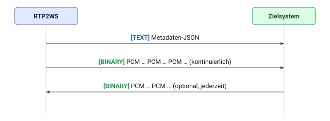

# RTP2WS — WebSocket-Integrationsleitfaden

Dieses Dokument beschreibt das WebSocket-Protokoll, mit dem RTP2WS Live-Audio eines
Anrufs an das Zielsystem streamt und Audio vom Zielsystem entgegennimmt. Es enthält
alles, was das Zielsystem zur Umsetzung der empfangenden Seite benötigt.

## 1. Rollen und Verbindung

- **Das Zielsystem betreibt einen WebSocket-Server.** RTP2WS verbindet sich als
  **Client** damit (die `wss://`-URL wird auf der RTP2WS-Seite je Ziel konfiguriert).
- Eine WebSocket-Verbindung entspricht **einem laufenden Telefonanruf**.
- Die Verbindung wird geöffnet, **sobald der Anruf angenommen wird**, und geschlossen,
  wenn der Anruf endet (siehe §6).

RTP2WS kann dem WebSocket-Handshake konfigurierte HTTP-Header hinzufügen (zum Beispiel
`Authorization: Bearer …`), damit das Zielsystem die Verbindung authentifizieren kann.
Die genauen Header-Namen und -Werte werden mit dem RTP2WS-Betreiber vorab abgestimmt.

## 2. Nachrichtenablauf

Nachrichten werden ausschließlich über den WebSocket-**Frame-Typ** unterschieden — es
gibt keinen zusätzlichen Header und keine Hülle (Envelope) innerhalb der Daten:

1. **Erste Nachricht — ein TEXT-Frame:** ein JSON-**Metadaten**-Objekt, das den Anruf
   beschreibt (§3). Wird unmittelbar nach dem Verbindungsaufbau gesendet, vor jeglichem
   Audio.
2. **Danach — BINARY-Frames:** rohes PCM-Audio des Anrufs, kontinuierlich gestreamt
   (§4).

Das Zielsystem erhält niemals einen zweiten Text-Frame. Alles, was es
**zurücksendet**, muss ausschließlich aus **BINARY**-Audio-Frames bestehen (§5) — ein
Metadaten-Frame wird nicht gesendet.



## 3. Metadaten (erster TEXT-Frame)

```json
{
  "callId": "1720000000.42",
  "fromNumber": "+49301234567",
  "toNumber": "+49151234567",
  "startedAt": "2026-07-01T12:00:00.000Z",
  "audio": {
    "sampleRate": 8000,
    "format": "s16le",
    "captureChannels": 1,
    "injectChannels": 1,
    "monoWhisperTarget": "callee"
  }
}
```

| Feld                      | Typ            | Bedeutung                                                                                                                                                        |
| ------------------------- | -------------- | ---------------------------------------------------------------------------------------------------------------------------------------------------------------- |
| `callId`                  | string         | Eindeutige Kennung dieses Anrufs. Als opak behandeln.                                                                                                            |
| `fromNumber`              | string \| null | Rufnummer des Anrufers, meist E.164 (`+…`); `null`, wenn unterdrückt oder anonym.                                                                                |
| `toNumber`                | string         | Rufnummer des angerufenen Teilnehmers, E.164 (`+…`).                                                                                                             |
| `startedAt`               | string         | Zeitpunkt der Anrufannahme, UTC ISO-8601.                                                                                                                        |
| `audio.sampleRate`        | int            | Abtastrate in Hz: `8000` oder `16000`.                                                                                                                           |
| `audio.format`            | string         | Immer `"s16le"` — 16 Bit vorzeichenbehaftet, Little-Endian.                                                                                                      |
| `audio.captureChannels`   | int            | Kanäle im Audio, das **das Zielsystem empfängt**: `2` = Stereo, `1` = Mono.                                                                                      |
| `audio.injectChannels`    | int            | Kanäle im Audio, das **das Zielsystem senden darf**: `2` = Stereo, `1` = Mono.                                                                                   |
| `audio.monoWhisperTarget` | string         | Nur relevant bei `injectChannels == 1`: welcher Teilnehmer das Mono-Audio des Zielsystems hört — `caller` (Anrufer), `callee` (Angerufener) oder `both` (beide). |

Der `audio`-Block bestimmt für diesen Anruf vollständig das Byte-Layout in beiden
Richtungen. Das Zielsystem liest ihn aus, bevor es Audio verarbeitet, und setzt keine
festen Werte voraus.

## 4. Audio, das das Zielsystem empfängt (BINARY-Frames)

Jeder Binär-Frame von RTP2WS enthält **rohes PCM** ohne Header:

- **Sample-Format:** 16-Bit-Ganzzahl mit Vorzeichen, **Little-Endian** (`s16le`).
- **Abtastrate:** `audio.sampleRate` (8000 oder 16000 Hz).
- **Kanäle:** `audio.captureChannels`.
  - **`2` (Stereo):** verschachtelt (interleaved), **links = Anrufer, rechts =
    Angerufener** (`L₀ R₀ L₁ R₁ …`). So lassen sich die beiden Sprecher unterscheiden.
  - **`1` (Mono):** ein einzelner gemischter Stream beider Teilnehmer.

Das Zielsystem behandelt die Binär-Frames als **kontinuierlichen Byte-Stream**. Frames
treffen etwa alle 20 ms ein, **doch auf Frame-Grenzen oder -Größen darf es sich nicht
verlassen** — es fügt die Nutzdaten zusammen und zerlegt sie eigenständig in Samples.

## 5. Audio, das das Zielsystem sendet (optional, BINARY-Frames)

Das Senden von Audio ist optional; eine rein empfangende Integration ist zulässig.
Wenn das Zielsystem sendet, wird das Audio in den laufenden Anruf gemischt:

- **Gleiches Format wie oben:** `s16le` mit `audio.sampleRate`.
- **Kanäle:** `audio.injectChannels`.
  - **`2` (Stereo):** verschachtelt, **links → Anrufer, rechts → Angerufener**. Der
    linke Kanal ist nur für den Anrufer hörbar, der rechte nur für den Angerufenen.
    Um nur einen Teilnehmer anzusprechen, wird auf dem anderen Kanal **Stille
    (Null-Samples)** gesendet.
  - **`1` (Mono):** hörbar für den in `audio.monoWhisperTarget` genannten Teilnehmer
    (`caller`, `callee` oder `both`).
- **Taktung:** Das Zielsystem sendet ungefähr in **Echtzeit** (also etwa eine Sekunde
  Audio pro Sekunde). RTP2WS puffert eine kleine Menge und speist sie getaktet in den
  Anruf ein; Audio, das weit über diesen Puffer hinaus schneller als in Echtzeit
  gesendet wird, wird **verworfen**.
- Die Frame-Größen bestimmt das Zielsystem selbst; es muss keine 20-ms-Grenzen
  einhalten.

## 6. Lebenszyklus und Beenden des Anrufs

- **Das Zielsystem schließt die Verbindung sauber** (regulärer
  WebSocket-Close-Handshake): standardmäßig **endet damit der Anruf**. Dies ist der
  vorgesehene Weg, um den Anruf von Seiten des Zielsystems aufzulegen. (Dieses Verhalten
  ist auf der RTP2WS-Seite je Ziel konfigurierbar — dies ist mit dem Betreiber
  abzustimmen, falls sich das Zielsystem darauf verlässt.)
- **Die Verbindung bricht unerwartet ab** (Netzwerkfehler, Absturz des
  Zielsystem-Prozesses, TCP-Reset): standardmäßig **läuft der Anruf ohne Streaming
  weiter**, und RTP2WS stellt die Verbindung **nicht** wieder her. Ein versehentlicher
  Abbruch beendet also keinen laufenden Anruf, doch das Zielsystem kann das Streaming
  für diesen Anruf auch nicht wieder aufnehmen.
- **Einer der Telefonteilnehmer legt auf:** der Anruf endet und RTP2WS schließt die
  WebSocket-Verbindung. Das Zielsystem behandelt ein serverseitiges Schließen als
  Anrufende und gibt Ressourcen frei.

## 7. Kurzreferenz

Bytes pro 20-ms-Audioabschnitt, nach Abtastrate und Kanalanzahl:

| Abtastrate | Mono (1 Kanal) | Stereo (2 Kanäle) |
| ---------- | -------------: | ----------------: |
| 8 000 Hz   |      320 Bytes |         640 Bytes |
| 16 000 Hz  |      640 Bytes |        1280 Bytes |

(16-Bit-Samples = 2 Bytes/Sample; pro Kanal: `Abtastrate × 0,020 × 2` Bytes.)

### Zusammenfassung der Umsetzung

Eine konforme Integration führt die folgenden Schritte aus:

1. Die eingehende WebSocket-Verbindung annehmen und dabei etwaige vereinbarte
   Authentifizierungs-Header prüfen.
2. Den ersten **Text**-Frame als Metadaten-JSON parsen und den `audio`-Block auslesen,
   um das Format für die restliche Verbindung zu bestimmen.
3. Die nachfolgenden **Binär**-Frames als kontinuierlichen `s16le`-PCM-Stream
   verarbeiten.
4. Optional **Binär**-Frames mit `s16le`-PCM in Echtzeit zurücksenden, ohne einen
   Metadaten-Frame.
5. Die Verbindung sauber schließen, um den Anruf zu beenden, und ein serverseitiges
   Schließen als Anrufende behandeln.
