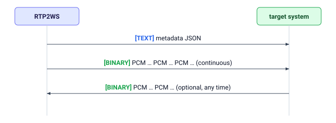

# RTP2WS — WebSocket Integration Guide

This document describes the WebSocket protocol RTP2WS uses to stream live call audio
to the target system and to accept audio back from it. It is everything the target
system needs to implement the receiving side.

## 1. Roles and connection

- **The target system runs a WebSocket server.** RTP2WS connects to it as a
  **client** (the `wss://` URL is configured on the RTP2WS side per destination).
- One WebSocket connection corresponds to **one live phone call**.
- The connection opens **when the call is answered**, and closes when the call ends
  (see §6).

RTP2WS may add configured HTTP headers to the WebSocket handshake (for example
`Authorization: Bearer …`) so the target system can authenticate the connection. The
exact header names and values are agreed with the RTP2WS operator out of band.

## 2. Message flow

Messages are distinguished purely by WebSocket **frame type** — there is no in-band
header or envelope:

1. **First message — one TEXT frame:** a JSON **metadata** object describing the call
   (§3). Sent immediately after the connection opens, before any audio.
2. **Then — BINARY frames:** raw PCM audio of the call, streamed continuously (§4).

The target system never receives a second text frame. Anything it **sends** back must
be **BINARY** audio frames only (§5) — do not send a metadata frame.



## 3. Metadata (first TEXT frame)

```json
{
  "callId": "1720000000.42",
  "fromNumber": "+49301234567",
  "toNumber": "+49151234567",
  "startedAt": "2026-07-01T12:00:00.000Z",
  "audio": {
    "sampleRate": 8000,
    "format": "s16le",
    "captureChannels": 1,
    "injectChannels": 1,
    "monoWhisperTarget": "callee"
  }
}
```

| Field                     | Type           | Meaning                                                                                                                   |
| ------------------------- | -------------- | ------------------------------------------------------------------------------------------------------------------------- |
| `callId`                  | string         | Unique identifier for this call. Treat as opaque.                                                                         |
| `fromNumber`              | string \| null | Caller's number, usually E.164 (`+…`); `null` if withheld or anonymous.                                                   |
| `toNumber`                | string         | Called party's number, E.164 (`+…`).                                                                                      |
| `startedAt`               | string         | Call-answer time, UTC ISO-8601.                                                                                           |
| `audio.sampleRate`        | int            | Sample rate in Hz: `8000` or `16000`.                                                                                     |
| `audio.format`            | string         | Always `"s16le"` — 16-bit signed, little-endian.                                                                          |
| `audio.captureChannels`   | int            | Channels in the audio **the target system receives**: `2` = stereo, `1` = mono.                                           |
| `audio.injectChannels`    | int            | Channels in the audio **the target system may send**: `2` = stereo, `1` = mono.                                           |
| `audio.monoWhisperTarget` | string         | Only relevant if `injectChannels == 1`: which party hears the target system's mono audio — `caller`, `callee`, or `both`. |

The `audio` block fully determines the byte layout in both directions for this call.
Read it before processing audio; do not assume fixed values.

## 4. Audio the target system receives (BINARY frames)

Every binary frame from RTP2WS is **raw PCM**, with no header:

- **Sample format:** 16-bit signed integer, **little-endian** (`s16le`).
- **Sample rate:** `audio.sampleRate` (8000 or 16000 Hz).
- **Channels:** `audio.captureChannels`.
  - **`2` (stereo):** interleaved, **left = caller, right = callee**
    (`L₀ R₀ L₁ R₁ …`). This lets the target system tell the two speakers apart.
  - **`1` (mono):** a single mixed stream of both parties.

Treat the binary frames as a **continuous byte stream**. Frames arrive roughly every
20 ms, but **do not rely on frame boundaries or sizes** — concatenate the payloads
and slice into samples independently.

## 5. Audio the target system sends (optional, BINARY frames)

Sending audio is optional; a receive-only integration is fine. When the target system
does send, the audio is mixed into the live call:

- **Same format as above:** `s16le` at `audio.sampleRate`.
- **Channels:** `audio.injectChannels`.
  - **`2` (stereo):** interleaved, **left → caller, right → callee**. Left is heard
    only by the caller, right only by the callee. To address just one party, send
    **silence (zero samples)** on the other channel.
  - **`1` (mono):** heard by the party named in `audio.monoWhisperTarget`
    (`caller`, `callee`, or `both`).
- **Pacing:** send at roughly **real time** (i.e. ~one second of audio per second).
  RTP2WS buffers a small amount and paces it into the call; audio sent far faster
  than real time beyond that buffer is **dropped**.
- Frame sizes are up to the target system; they need not match 20 ms boundaries.

## 6. Lifecycle and ending the call

- **The target system closes the socket cleanly** (a normal WebSocket close
  handshake): by default this **ends the call**. This is the intended way for the
  target system to hang up the call from its side. (This behavior is configurable per
  destination on the RTP2WS side — confirm with the operator if the target system
  relies on it.)
- **The connection drops unexpectedly** (network failure, the target system's process
  crashes, TCP reset): by default the **call continues** without streaming, and RTP2WS
  does **not** reconnect. So an accidental disconnect will not drop a live call, but the
  target system also cannot resume streaming on that call.
- **Either phone party hangs up:** the call ends and RTP2WS closes the WebSocket. The
  target system should treat a server-side close as end-of-call and release resources.

## 7. Quick reference

Bytes per 20 ms audio chunk, by sample rate and channel count:

| Sample rate | Mono (1 ch) | Stereo (2 ch) |
| ----------- | ----------: | ------------: |
| 8 000 Hz    |   320 bytes |     640 bytes |
| 16 000 Hz   |   640 bytes |    1280 bytes |

(16-bit samples = 2 bytes/sample; per channel: `sampleRate × 0.020 × 2` bytes.)

### Implementation summary

A conforming integration performs the following steps:

1. Accept the incoming WebSocket connection, validating any agreed authentication
   headers.
2. Parse the first **text** frame as metadata JSON and read the `audio` block to
   determine the format for the remainder of the connection.
3. Consume subsequent **binary** frames as a continuous `s16le` PCM stream.
4. Optionally send **binary** `s16le` PCM in return at real-time rate, without any
   metadata frame.
5. Close the connection cleanly to end the call, and treat a server-initiated close
   as end-of-call.
